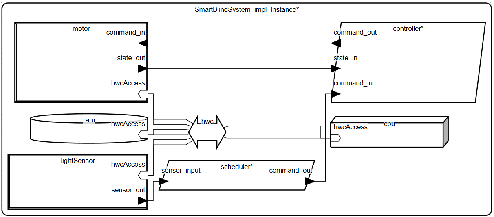

# Sterowanie Żaluzjami

#### Opis

Inteligentny system sterowania roletami okiennymi, który automatycznie otwiera i zamyka rolety w zależności od natężenia światła zarejestrowanego przez czujnik światła. System składa się z kontrolera, silnika rolet, czujnika światła oraz modułu harmonogramującego decyzje na podstawie odczytów sensora.

System realizuje podstawowe polecenia: otwórz, zamknij, zatrzymaj oraz śledzi stan rolet: zamknięte, otwieranie, otwarte, zamykanie. Sterowanie odbywa się w czasie rzeczywistym, z określonymi interwałami czasowymi i gwarantowaną wydajnością.

#### Dla użytkownika

Użytkownik może spodziewać się automatycznego dostosowania położenia rolet w zależności od światła zewnętrznego. Gdy jest jasno, rolety otwierają się, a przy zmniejszonym świetle zamykają się.

---

## Spis komponentów
| Komponent               | Typ           | Opis                                                             |
|-------------------------|---------------|-----------------------------------------------------------------|
| `BlindState`            | Data          | Typ wyliczeniowy stanu rolet (zamknięte, otwieranie itd.)      |
| `BlindCommand`          | Data          | Typ wyliczeniowy poleceń (otwórz, zamknij, stop)                |
| `LightSensorValue`      | Data          | Typ wartości odczytu czujnika światła (Unsigned 16 bit)          |
| `SmartBlindSystem`      | System        | Główny system łączący procesy, urządzenia i magistralę          |
| `BlindController`       | Process       | Proces kontrolujący silnik rolet na podstawie komend i stanu    |
| `SensorBasedScheduler`  | Process       | Proces podejmujący decyzje na podstawie wartości czujnika       |
| `BlindMotor`            | Device        | Urządzenie silnika rolet                                         |
| `LightSensor`           | Device        | Urządzenie czujnika światła                                     |
| `ControlThread`         | Thread        | Wątek realizujący logikę kontrolera                             |
| `SchedulerThread`       | Thread        | Wątek realizujący logikę harmonogramowania                      |
| `CPU`                   | Processor     | Procesor wykonujący wątki                                       |
| `RAM`                   | Memory        | Pamięć systemowa                                                 |
| `HWConnection`          | Bus           | Magistrala łącząca CPU, RAM i urządzenia                         |

---

## Model - rysunek

---

## Wyniki przeprowadzonych analiz

- Model poprawny składniowo, brak błędów w OSATE.
- Wszystkie połączenia portów i magistral są spójne i dobrze zdefiniowane.
- Mapowanie urządzeń i wątków na magistralę `HWConnection` pozwala na efektywną komunikację.

---

## Inne informacje

- Model można rozszerzyć o implementacje logiki w wątkach `ControlThread` i `SchedulerThread`.
- Można dodać obsługę dodatkowych sensorów lub mechanizmów bezpieczeństwa.
