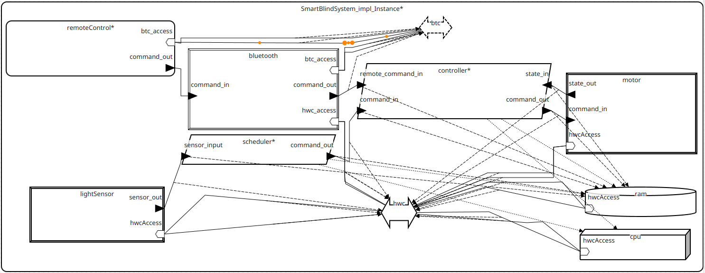
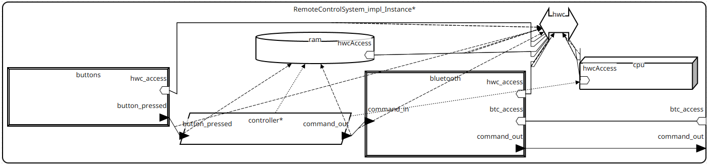

# Sterowanie Żaluzjami

#### Opis

Inteligentny system sterowania roletami okiennymi, który automatycznie otwiera i zamyka rolety zdalnie za pomocą pilota lub w zależności od natężenia światła zarejestrowanego przez czujnik światła. System składa się z kontrolera, silnika rolet, pilota z przyciskami, czujnika światła oraz modułu harmonogramującego decyzje na podstawie odczytów sensora.

System realizuje podstawowe polecenia: otwórz, zamknij, zatrzymaj oraz śledzi stan rolet: zamknięte, otwieranie, otwarte, zamykanie. Sterowanie odbywa się w czasie rzeczywistym, z określonymi interwałami czasowymi i gwarantowaną wydajnością.

#### Dla użytkownika

- **Tryb automatyczny** – czujnik światła decyduje o otwieraniu lub zamykaniu żaluzji.
- **Tryb ręczny** – użytkownik korzysta z pilota Bluetooth, by ręcznie sterować żaluzjami.

---

## 🧩 Komponenty systemu
| Komponent               | Typ           | Opis                                                             |
|-------------------------|---------------|-----------------------------------------------------------------|
| `SmartBlindSystem`       | system         | Główna jednostka systemowa.                           |
| `BlindController`        | process        | Zarządza komendami i stanami żaluzji.                |
| `SensorBasedScheduler`   | process        | Wydaje decyzje na podstawie czujnika światła.        |
| `BlindMotor`             | device         | Wykonuje fizyczne ruchy żaluzji (50ms).              |
| `LightSensor`            | device         | Mierzy natężenie światła (100ms).                    |
| `BluetoothDevice`        | device         | Komunikuje się bezprzewodowo (z pilotem).            |
| `RemoteControlSystem`    | system         | Pilot użytkownika.                                   |
| `Buttons`                | device         | Interfejs fizycznych przycisków.                     |
| `CPU`, `RAM`             | processor / memory | Sprzętowa platforma obliczeniowa.                 |
| `HWConnection`, `Bluetooth` | bus / virtual bus | Kanały komunikacji danych.  |

---

## 🧪 Typy danych (`customTypes`)

| Typ                 | Przykładowe wartości                  | Rozmiar |
|---------------------|----------------------------------------|---------|
| `BlindCommand`      | `Open`, `Close`, `Stop`               | 4B      |
| `BlindState`        | `Closed`, `Opening`, `Opened`, `Closing` | 4B   |
| `ButtonCommand`     | `Up`, `Down`, `Stop`                  | 4B      |
| `LightSensorValue`  | wartość `uint16`                      | 2B      |

---

## 🛠️ Parametry platformy (`customHardware`)

| Komponent    | Parametry                                  |
|--------------|---------------------------------------------|
| `CPU`        | 120 MIPS, 0.05kg                            |
| `RAM`        | 0.025kg                                     |
| `HWConnection` | 1000 Mbps, 0.1kg                        |
| `Bluetooth`  | 2 Mbps (wirtualna szyna)                    |

## Modele

#### SmartBlindSystem

#### RemoteControlSystem

---

## Wyniki przeprowadzonych analiz

- **Check Bindings Constraints** – Nie znaleziono błędów.
- **Check Connection Binding Consistency** – Wszystkie połączenia portów i magistral są spójne i dobrze zdefiniowane.

---

## Inne informacje

- Zastosowany został podział na podsystemy.
- Model można rozszerzyć o implementacje logiki w wątkach `ControlThread` i `SchedulerThread`.
- Można dodać obsługę dodatkowych sensorów lub mechanizmów bezpieczeństwa.
